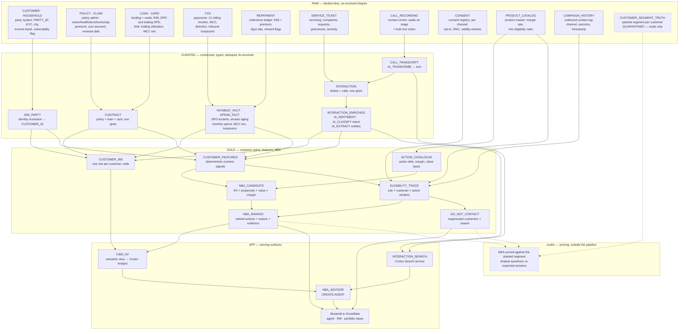

# C360-NBA — Customer 360 + Next Best Action Engine

**Snowflake CoCo CLI Hackathon (GCC edition) — problem statement: "AI-Native Data Application"**

A Customer 360 and Next Best Action engine for an Indian bank-and-insurer group.
One customer spine fuses structured book-of-business data with unstructured
interactions and emits a **ranked list of next best actions per customer** — each
carrying a reason, an expected value in INR, the evidence it was drawn from, and a
compliance trace showing why the customer was eligible to be contacted.

---

## 0. Status of this document

This brief is the **pre-build contract**. It was written in Phase 0, before any
object existed, to fix the architecture, the constraints and the risk register
before a credit was spent. It is kept as written, because §2, §8 and §9 are what
the build was actually steered by and rewriting them afterwards would destroy
that record.

It is therefore **not the as-built description — `README.md` is.** Where the two
disagree, the README and the files in `sql/` are correct. §6 below has been
updated to the as-built layout; §10 is the original milestone plan, kept as
history. Every delta found by diffing this document against the repository:

| Planned here | What was actually built |
|---|---|
| 32 script slots, `sql/00`–`sql/32` | 23 scripts, `sql/00`–`sql/20` — see §6 |
| A separate CURATED conform block (`10`–`13`) | Conforming happens inside `05`, `07` and `08`. `CURATED.DIM_PARTY`, `CONTRACT`, `PAYMENT_FACT`, `SPEND_FACT` and `INTERACTION` were never created as standalone objects |
| `GOLD.ACTION_CATALOGUE`, `ELIGIBILITY_TRACE`, `DO_NOT_CONTACT`, `NBA_CANDIDATE`, `NBA_RANKED` | `GOLD.ACTION_CATALOG`, `GOLD.NBA_ELIGIBLE` (candidates, rule verdicts and suppression in one table), `GOLD.NBA_SCORED`, `GOLD.NEXT_BEST_ACTION` |
| `APP.INTERACTION_SEARCH`, `APP.NBA_ADVISOR`, `C360_SV` | `APP.SEARCH_INTERACTIONS` **and** `APP.SEARCH_PRODUCT_DOCS`, `APP.RM_COPILOT`, `GOLD.SV_CUSTOMER_360` |
| `CURATED.CALL_TRANSCRIPT`, `CURATED.INTERACTION_ENRICHED` | Absorbed into `CURATED.INTERACTION_SIGNALS(_GATED)` over the single `RAW.INTERACTION` grain |
| ~25,000 interactions, ~12 audio fixtures | 1,203 interactions, of which **3** are genuinely transcribed audio |
| `claude-opus-5` for the rationale layer | `claude-haiku-4-5` for corpus, enrichment and rationale; `claude-sonnet-4-5` for the product documents; `llama3.3-70b` as a token-sizing proxy only. **No pipeline script calls `claude-opus-5`** |
| Three Streamlit views | Four screens — portfolio cockpit, customer 360, ask, impact |
| `sql/90_verify.sql`, `sql/99_teardown.sql`, `docs/README.md` | Not built. Assertions live inside each numbered script; `evals/REPORT.md` carries the scored results |
| One non-SQL step in the rebuild | Two — the audio stage copy before `sql/06`, and the app stage copy before `sql/20` (itself two commands, see D2) |

One thing this document claims that is **not** yet proven, and is called out again
in the README: `run.sh` is written and validated but has never been executed as a
live drop-and-rebuild. The rebuild path is provable by inspection, not by a timed
log.

---

## 1. Users and pain

| User | Today | What this gives them |
|---|---|---|
| **Contact-centre agent** | Sees a wall of history mid-call. No recommendation, no reason. | Top 3 actions for the customer on screen, each with a one-line reason and the exact evidence behind it. |
| **Relationship manager** | Same wall, plus a book of customers and no prioritisation. | Their book ranked by expected value, with talking points per customer. |
| **Portfolio owner** | Cannot see which actions across the book are worth taking this week. | Book-level view of actions by expected value, and an explicit **do-not-contact** list with reasons. |
| **Compliance / risk** | Cannot reconstruct why a customer was targeted. | Per-recommendation compliance trace: every rule evaluated, its verdict, and the values it fired on. |

### The silo problem

Four sources, no join key in common use:

1. **Policy / loan systems of record** — the book of business.
2. **Payments and arrears** — premium and EMI collection, DPD buckets.
3. **Servicing tickets** — complaints, requests, grievances.
4. **Call recordings** — contact-centre audio, never mined.

Signals that matter live *across* these. A customer with a 45-day-overdue EMI, an
open grievance, and an angry call last week must not be cross-sold — but no single
system knows all three facts.

---

## 2. Product principles

These are non-negotiable and drive the architecture.

1. **Expected value is deterministic SQL, not an LLM guess.**
   `EV = propensity × value_at_stake × margin_rate`, every term computed in SQL from
   the book. An LLM that invents a rupee figure is not auditable and not defensible
   in a demo. The LLM writes the *narrative*, never the number.
2. **Compliance is deterministic rules with a stored trace.**
   Eligibility is never an LLM judgement. Each rule is a SQL predicate; each
   evaluation is persisted per customer per action so the verdict can be replayed.
3. **Suppression beats recommendation.**
   A do-not-contact verdict always wins over any expected value, however large.
4. **Every recommendation cites evidence.**
   Each action links to the specific interactions, tickets, transcripts and ledger
   rows that produced it. No evidence, no action.
5. **AI is applied where it is the only tool that works** — reading free text and
   audio, summarising, classifying intent — and nowhere else.

---

## 3. Hard constraints

- **One Snowflake account.** Database `C360_NBA`, role `COCO_BUILDER`, warehouse `COCO_WH`.
- **Schemas:** `RAW` → `CURATED` → `GOLD` → `APP`.
- **Snowflake-native only:** AI SQL functions, Cortex Search, semantic views +
  Cortex Analyst, `CREATE AGENT`, Streamlit in Snowflake. No external services,
  no external access integrations.
- **Every object is created by a numbered, idempotent script in `sql/`** that rebuilds
  the whole project from an empty database. `CREATE OR REPLACE` throughout.
  No manual Snowsight steps after bootstrap. One unavoidable exception, wrapped in
  `run.sh` — see decision D2.
- **Synthetic data only.** INR, Indian names and cities.

---

## 4. Target architecture



Every node above is a table that exists in `sql/02_schema_raw.sql`, except
`CALL_RECORDING` (built by `04_raw_calls.sql`, see D1) and the `CURATED` / `GOLD`
/ `APP` layers, which are still to come. RAW nodes are grouped by system of
record rather than one node per table — that grouping *is* the silo problem in
§1: `R3` knows a customer holds a home loan and `R2` knows they have no home
cover, and nothing joins them until `C2`.

`R11 CUSTOMER_SEGMENT_TRUTH` is drawn dashed and connected only to `evals/`
because it is the answer key. Its predicates are in `docs/DATA_SEGMENTS.md`.

### Where AI is used, and where it deliberately is not

| Layer | AI function | Why AI is the right tool here |
|---|---|---|
| `CURATED.CALL_TRANSCRIPT` | `AI_TRANSCRIBE` | Audio → text. No SQL alternative. |
| `CURATED.INTERACTION_ENRICHED` | `AI_SENTIMENT` | Tone of a free-text note or transcript. |
| `CURATED.INTERACTION_ENRICHED` | `AI_CLASSIFY` | Intent taxonomy over unstructured text. |
| `CURATED.INTERACTION_ENRICHED` | `AI_EXTRACT` | Pull policy numbers, amounts, competitor mentions out of prose. |
| `GOLD.NBA_RANKED` | `AI_COMPLETE` (structured output) | Write the agent-facing *reason* and talking points, grounded in retrieved evidence. |
| `APP.INTERACTION_SEARCH` | Cortex Search | Retrieve the evidence passages an action cites. |
| `APP.NBA_ADVISOR` | `CREATE AGENT` + Cortex Analyst | Natural-language questions over the book. |
| **`GOLD.NBA_CANDIDATE` — expected value** | **none, by design** | Must be auditable arithmetic. |
| **`GOLD.ELIGIBILITY_TRACE` — compliance** | **none, by design** | Must be replayable rules, not judgement. |

---

## 5. The NBA contract

Each row of `GOLD.NBA_RANKED` answers five questions:

| Field group | Content |
|---|---|
| **What** | `ACTION_CODE`, `ACTION_NAME`, `CHANNEL`, `RANK` |
| **Why** | `REASON` (LLM, grounded), `DRIVER_FEATURES` (which signals fired) |
| **Worth** | `PROPENSITY`, `VALUE_AT_STAKE_INR`, `MARGIN_RATE`, `EXPECTED_VALUE_INR` |
| **Evidence** | `EVIDENCE_IDS` (interaction/ticket/transcript/ledger refs), `EVIDENCE_QUOTES` |
| **Allowed** | `ELIGIBLE`, `RULES_PASSED`, `RULES_FAILED`, `SUPPRESSION_REASON` |

Compliance rules in scope (deterministic, each with a trace row):

- Channel consent present and not withdrawn (`CONSENT_REGISTRY`).
- Not on DND for the proposed channel.
- No open grievance above a severity threshold.
- Cooling-off period since last outbound contact respected.
- Suitability: product not sold to a customer already holding it.
- Arrears gate: no cross-sell or upsell while in a DPD bucket beyond threshold.
- Vulnerability gate: flagged customers routed to service actions only.

---

## 6. Repository layout

```
sql/
  00_bootstrap.sql            role, warehouse, budget, database (ACCOUNTADMIN)
  02_schema_raw.sql           RAW schema, table DDL, seeded PRNG helpers
  03_seed_raw.sql             5,000 customers and their structured history
  04_seed_interactions.sql    RAW.INTERACTION — 1,200 generated artefacts
  05_curated_signals.sql      INTERACTION_SIGNALS(_GATED) — five AI calls per row
  06_audio_demo.sql           RAW.AUDIO_STAGE + AI_TRANSCRIBE over 3 fixtures
  07_curated_rollup.sql       CURATED.CUSTOMER_INTERACTION_ROLLUP
  08_gold_c360.sql            GOLD.CUSTOMER_360, GOLD.CUSTOMER_TIMELINE
  09_semantic_view.sql        the five GOLD.V_SV_* feeder shims
  10_search_services.sql      APP.SEARCH_INTERACTIONS, APP.SEARCH_PRODUCT_DOCS
  10b_suspend_search.sql      stop paying for idle retrieval
  10c_resume_search.sql       bring it back up before a demo
  11_action_catalog.sql       GOLD.ACTION_CATALOG — 18 actions, margins, disclosures
  12_nba_eligibility.sql      GOLD.NBA_ELIGIBLE — every candidate, every rule
  13_nba_scoring.sql          GOLD.NBA_SCORED — propensity and expected value
  14_nba_reasoning.sql        the written rationale, validated
  15_nba_publish.sql          GOLD.NEXT_BEST_ACTION
  16_semantic_view_nba.sql    GOLD.SV_CUSTOMER_360 — the authoritative definition
  17_nba_tool.sql             APP.GET_NEXT_BEST_ACTIONS, APP.FORMAT_INR
  18_agent.sql                APP.RM_COPILOT — four tools
  18b_agent_grants_admin.sql  the one grant COCO_BUILDER cannot make
  19_app_objects.sql          APP_STAGE, ACTION_FEEDBACK, the app's read views
  20_streamlit.sql            APP.C360_APP
app/                          Streamlit in Snowflake source
data/audio/                   three committed call-recording fixtures (.m4a)
docs/DATA_SEGMENTS.md         planted segments + identifying predicates
docs/DEMO_SCRIPT.md           the timed walkthrough
docs/VIDEO_SCRIPT.md          the submission recording
evals/                        both eval suites and REPORT.md
tools/reset_demo.sh           clear demo state between judging sessions
run.sh                        full rebuild, both non-SQL stage-copy steps included
```

Every SQL script is re-runnable against a database in any state. `run.sh` exists
because exactly one step in the rebuild is not SQL — see decision D2.

**Numeric order is run order, and it follows the dependency graph.** Three
consequences worth noting, since none is obvious from the numbers alone:

- **`10_search_services.sql` sits between the spine and the engine, not with the
  other `APP` objects.** It depends only on the enrichment in `04`–`05`, and
  `14_nba_reasoning.sql` cites evidence resolved through it, so it has to be built
  before the NBA block rather than alongside the semantic view and agent.
- **There is no separate schema script.** Each layer's first file creates its own
  schema with `IF NOT EXISTS` — `02_schema_raw.sql` creates `RAW`, and so on —
  which keeps every layer runnable standalone against an empty database. The
  planned `01_schemas.sql` was never written.
- **`03_seed_raw.sql` covers the book, payments and servicing silos in one
  script.** They share the ground-truth table and condition on each other, so
  splitting them across three files would mean three files that cannot be run
  independently anyway. Calls stay separate in `04` because the audio path is
  genuinely independent — see D1.

- **The semantic view moved OUT of `09` and into `16`, and it had to.** `09` was
  written to create `GOLD.SV_CUSTOMER_360` over the spine and four facts, and
  deliberately excluded `GOLD.NEXT_BEST_ACTION` because the table then held
  placeholder propensities. M9 added the engine to the model, which needs
  `GOLD.NBA_ELIGIBLE` (created at `12`, and the only place suppression is
  recorded) and `GOLD.V_NEXT_BEST_ACTION_AUDIT` (created at `15`). A feeder view
  over a table that does not exist yet fails at CREATE, so the definition could
  not stay at `09`; and `ALTER SEMANTIC VIEW` changes only the comment, the tags
  and the materializations, so there was no incremental path either. The choice
  was between duplicating ~830 lines of definition and moving it. `09` now
  creates the five `V_SV_` shims and one assertion; `16` is the single
  authoritative definition and carries the three `SEMANTIC_VIEW()` assertions
  that used to live in `09` §3.2–3.4. `09`'s A2 assertion — "`NEXT_BEST_ACTION`
  is not referenced" — was deleted in the same commit that added the table, which
  is what its own comment asked for.

- **The unstructured layer landed at `04`–`07`, not at `04`/`13`/`14`/`15`.** The
  original numbering put text generation at `04_raw_calls.sql` and enrichment in
  the `CURATED` block at `14`/`15`. What was actually built is
  `04_seed_interactions.sql` → `05_curated_signals.sql` → `06_audio_demo.sql` →
  `07_curated_rollup.sql`, kept contiguous because they form one dependency chain
  that has to be run in order and re-run as a unit while the corpus is being
  tuned. `14_curated_transcribe.sql` and `15_curated_enrich.sql` are therefore
  **gone**, their work absorbed into `05` and `06`; `CURATED.CALL_TRANSCRIPT` and
  `CURATED.INTERACTION_ENRICHED` do not exist as separate objects because text and
  transcribed audio deliberately share the single `RAW.INTERACTION` grain rather
  than being unioned later. `13_curated_interaction.sql` was never built
  either. It was to unify servicing tickets with interactions; `07` bridges that
  gap instead by reading `RAW.SERVICE_TICKET` directly, which is flagged in that
  file's header and is the one place the planned conform layer is genuinely
  missed.

---

## 7. Verified environment

Confirmed by live query against this account before any SQL was written.

| Fact | Value |
|---|---|
| Account / org | `TX54963` / `HPQQELD` |
| Region | `AWS_AP_SOUTH_1` (AWS Mumbai) |
| Version | `10.30.102` |
| Role | `COCO_BUILDER` — `CORTEX_USER`, `CORTEX_AGENT_USER`, `CREATE SCHEMA` on `C360_NBA` |
| Warehouse | `COCO_WH` (XSMALL) with `COCO_BUDGET` resource monitor, 60 credits/month |
| Credits consumed to date | 0.301 — measured before any build SQL ran. Final project spend is 62.73; see `README.md`. |
| Cross-region inference | `CORTEX_ENABLED_CROSS_REGION = ANY_REGION` |
| Object types recognised | Cortex Search service, semantic view, agent, Streamlit — all present in this version |

**No text-generation model is hosted in-region in Mumbai.** Every `AI_COMPLETE` call
routes cross-region. Only embedding models (`snowflake-arctic-embed-*`,
`multilingual-e5-large`) run natively in `AWS_AP_SOUTH_1`. If
`CORTEX_ENABLED_CROSS_REGION` is ever reset to `DISABLED`, the entire AI layer stops.

AI functions smoke-tested successfully for `COCO_BUILDER` in this region:
`AI_COMPLETE` (`claude-opus-5`), `AI_CLASSIFY`, `AI_FILTER`, `AI_EXTRACT`,
`AI_AGG`, `AI_SUMMARIZE_AGG`, `AI_SENTIMENT`, `AI_TRANSLATE` (English → Hindi),
`AI_SIMILARITY`, `AI_EMBED`.

### Capability matrix for `AWS_AP_SOUTH_1`

| Capability | Verdict | How |
|---|---|---|
| Cortex Search | **Available natively in Mumbai** | `snowflake-arctic-embed-m-v1.5`, `-l-v2.0`, `-l-v2.0-8k` all in-region. `voyage-multilingual-2` is **not** available here. |
| Semantic views | **Available** | No region or edition gate. |
| Cortex Analyst | **Available via cross-region** | Not native in Mumbai; `ANY_REGION` covers it. |
| `CREATE AGENT` | **Available via cross-region** | Agent orchestration models are cross-region only by design. |
| Streamlit in Snowflake | **Available** | No region restriction. |
| `AI_COMPLETE`, `AI_CLASSIFY`, `AI_EXTRACT`, `AI_FILTER`, `AI_SENTIMENT`, `AI_SUMMARIZE_AGG`, `AI_TRANSLATE`, `AI_SIMILARITY`, `AI_REDACT` | **Available via cross-region** | Cross-Cloud (Any Region) column ticked. |
| `AI_AGG` | **Available — verified empirically** | Docs leave the Any-Region column blank, but a live call in this account succeeded. |
| `AI_TRANSCRIBE` | **Available via cross-region — since verified** | Native only in Oregon / N. Virginia / Frankfurt / Azure East US 2. Verified in this account by `sql/06_audio_demo.sql`, which transcribes three committed `.m4a` fixtures onto the `RAW.INTERACTION` grain. |
| `AI_EMBED` | **Available**, embeddings in-region | Returns `VECTOR`. |

Embedding models for Cortex Search must be one of the three `snowflake-arctic-embed-*`
models, since those are the ones deployed in Mumbai.

---

## 8. Flagged risks — read before writing SQL

### R1. Cross-region inference is a single point of failure, and a narrative problem

No text-generation model is hosted in Mumbai. Every LLM call in this project leaves
the region. Two consequences:

- **Operational:** if `CORTEX_ENABLED_CROSS_REGION` is reset to `DISABLED`, the whole
  AI layer fails. Scripts must assert the parameter before the AI stages run.
- **Narrative:** a demo built for an Indian bank-and-insurer that ships prompts
  containing customer context out of India has an obvious data-residency question
  attached to it. This does not block the build, but it must be stated openly rather
  than discovered by a judge. The mitigations available in-region are: retrieval
  (Cortex Search) runs entirely in Mumbai on in-region embeddings, and `AI_REDACT`
  can strip PII before any prompt is sent cross-region. Both are worth doing on
  their own merits.

### R2. Budget is small relative to a naive AI design

60-credit monthly resource monitor with a hard suspend at 100%; 0.301 credits used.
Running a frontier model over every customer would be reckless. The design therefore
tiers models: a cheap model for bulk enrichment over all rows, a strong model only
for the narrow set of rows actually surfaced in the demo.

### R3. Cost telemetry lags, so token counting must be the gate

`SNOWFLAKE.ACCOUNT_USAGE.CORTEX_FUNCTIONS_USAGE_HISTORY` currently returns zero rows
despite AI calls having just run — this view has hours of latency. A
"run a sample, then check credits" gate does not work at demo tempo. Instead,
`AI_COUNT_TOKENS` is used to project cost before any batch run; it is instant and
available in every region. `COCO_BUILDER` also cannot read `ACCOUNT_USAGE` at all,
so after-the-fact verification needs the `coco_admin` (ACCOUNTADMIN) connection.

### R4. `sql/` alone cannot create the Streamlit object

`CREATE STREAMLIT` requires `streamlit_app.py` to already exist on a stage. A SQL
script cannot author a local file onto a stage; that needs a `PUT` or
`snow streamlit deploy` from the client. So the "everything is a numbered script in
`sql/`" rule has one unavoidable seam at the app layer. Resolution needed — see
open questions.

Note also that `ROOT_LOCATION` is now legacy; the current form is
`CREATE STREAMLIT … FROM '@stage/path' MAIN_FILE = 'streamlit_app.py'`, followed by
`ALTER STREAMLIT … ADD LIVE VERSION FROM LAST`.

### R5. Synthetic call audio cannot be produced Snowflake-natively

`AI_TRANSCRIBE` needs real audio on a stage. Nothing inside Snowflake generates
speech, and text-to-speech services are excluded by the no-external-services rule.
Either the audio path is demonstrated with locally generated fixture files committed
to the repo, or call recordings enter as already-transcribed text. Resolution needed
— see open questions.

### R6. Account edition unconfirmed

`SHOW ORGANIZATION ACCOUNTS` is blocked (no `MANAGE ORGANIZATION ACCOUNTS`) and
`ORGANIZATION_USAGE.USAGE_IN_CURRENCY_DAILY` is still empty. Edition is therefore
unverified. Low risk: nothing in this stack requires Enterprise — semantic views,
Cortex features and Streamlit have no edition gate, and no multi-cluster warehouse
or materialized view is used.

### R7. Bootstrap uses a deprecated function

`sql/00_bootstrap.sql` smoke-tests with `SNOWFLAKE.CORTEX.SENTIMENT`. That namespace
is deprecated; it should be `AI_SENTIMENT`. Cosmetic but worth fixing since the
bootstrap is the first thing a judge reads.

### R8. `AI_COUNT_TOKENS` undercounts by ~1.85×, so it is a sizing tool and not a gate

R3 proposed `AI_COUNT_TOKENS` as the cost gate because the usage views lag. Measured against
real billing on the M1 generation run, the projection was **970 input tokens per thread
against an actual 1,793** — a 1.85× undercount. Two independent causes, both structural
rather than incidental:

- **The `response_format` schema bills as input but is invisible to the counter.** Every
  structured-output call re-sends the JSON schema, and `AI_COUNT_TOKENS` has no argument
  through which the `AI_COMPLETE` schema can be supplied. Snowflake's own documentation
  notes structured output on Claude "can bill materially more tokens than estimated".
- **The counter rejects the `claude-4-x` families entirely**, so sizing has to be done with
  a supported proxy tokenizer (`llama3.3-70b` here). Tokenizers differ, and the direction of
  the error is not knowable in advance.

It also counts input only, so for any generative call it is a floor rather than an estimate —
on this workload output was 70% of the bill.

**The gate that actually works is a measured pilot.** Run a small batch, read
`SNOWFLAKE.ACCOUNT_USAGE.CORTEX_AI_FUNCTIONS_USAGE_HISTORY` — which lags ~5 minutes, not the
hours R3 observed on the older `CORTEX_FUNCTIONS_USAGE_HISTORY` — and extrapolate from real
credits. Its `METRICS` column carries input and output token counts separately, so a handful
of batches with differing mixes is enough to solve for the per-model rate directly:

```
claude-haiku-4-5   0.6 credits / M input tokens
                   3.0 credits / M output tokens
```

Derived from four billing rows and reproducing all four exactly. `AI_COUNT_TOKENS` keeps its
place for *relative* sizing — comparing two prompt designs, spotting a runaway input — but
no batch should be authorised on its absolute number. Reading this view requires the
`coco_admin` (ACCOUNTADMIN) connection; `COCO_BUILDER` cannot see `ACCOUNT_USAGE` at all.

**The measured-pilot method has its own failure mode, and it bit once.** The M1 enrichment
projection came in at half the true cost because the pilot batch was run twice (once per
`ENRICH_VERSION`) while the credits were summed over a time window containing only one of
those runs — then divided by both runs' row count. Every per-function rate was consequently
exactly 2× low, and the projected 5 credits became a measured 11.

Two rules follow, and they are cheap to obey:

- **Divide by the row count inside the measured window, not the row count you ran in total.**
  Filter the usage view to specific `QUERY_ID`s rather than a time range, since one script
  execution is one query per AI function and the row count per query is known exactly.
- **Re-measure after the first real batch, not only before it.** A 25-row pilot and a 300-row
  batch are different enough that the pilot rate should be treated as provisional. The 300-row
  passes each cost ~1.07 credits for `AI_EXTRACT`, which settles the rate at 0.00357/row
  against the pilot's apparent 0.00175.

Also: a function reporting `0.000000` credits on a small pilot is a rounding artefact, not a
free function. `AI_SENTIMENT` displayed zero over 25 rows and cost 0.96 credits over 1,200.

**A credit ceiling covers the whole milestone, not one script inside it.** M3's 15-credit
ceiling was stated while discussing corpus generation; generation came in at 2.33 and was
reported as comfortably inside budget, after which enrichment — a different file, five AI
functions per row — spent 11.2 more and took the milestone to 13.55 without anything pausing.
The scoping gap, not the model, caused that. Enumerate every AI call across every file in a
milestone before spending anything, carry a running total against the one number, and report
it as spent/remaining at each gate. The general rule is recorded in `AGENTS.md` so it survives
outside this document.

Note the shape of the spend, which is not intuitive: **per-row enrichment cost 4.8× the
generation of the corpus it read.** Milestone cost is dominated by whichever layer runs N AI
calls per row, not by the layer that produced the rows.

---

## 9. Decisions taken

These resolve the open questions raised by R2, R4 and R5, and fix the scope. They are
settled; the milestones below assume them.

### D1. Call recordings — hybrid, with a real audio path

The call silo carries generated text artefacts for volume, plus **genuine audio files**
committed under `data/audio/`, `PUT` to `RAW.AUDIO_STAGE` and transcribed for real with
`AI_TRANSCRIBE`. Fixtures are generated locally with the macOS `say` command; that is a
build-time fixture, not a runtime dependency, so the no-external-services rule holds at
runtime. This proves `AI_TRANSCRIBE` actually works in `AWS_AP_SOUTH_1` for negligible
cost.

**As built:** 1,200 generated artefacts plus **three** transcribed audio files, 1,203 in
total — not the ~25,000 and ~12 planned above. There is no separate
`CURATED.CALL_TRANSCRIPT` object either: transcribed audio lands on the same
`RAW.INTERACTION` grain as the text, so everything downstream sees one grain and cannot
tell which rows came from audio.

### D2. The documented non-SQL steps in the rebuild

`sql/` remains authoritative for every database object. Two steps are not SQL, and
`run.sh` wraps the whole sequence so the rebuild is one command and both seams are
explicit rather than hidden.

```
sql/00 … sql/05
  →  snow stage copy data/audio/ @RAW.AUDIO_STAGE
sql/06 … sql/19
  →  snow stage copy app/ @APP.APP_STAGE
  →  snow stage copy app/.streamlit/config.toml @APP.APP_STAGE/.streamlit/
sql/20_streamlit.sql
```

**As built, the app copy is two commands, not one.** A recursive stage copy silently
skips dot-directories, so `app/.streamlit/config.toml` was not uploaded and nothing
errored — the app ran with Streamlit's default red accent, which in this app collides
with the red that means "a compliance rule blocked this". `sql/20`'s own guard counts
the theme file for that reason.

### D3. Tiered models, token-gated

| Stage | Model | Volume |
|---|---|---|
| Bulk interaction enrichment — sentiment, intent, entity extraction | `claude-haiku-4-5` | ~25,000 interactions |
| Call transcription | `AI_TRANSCRIBE` default | ~12 files |
| NBA reason + talking points, demo slice | `claude-opus-5` | top 3 actions × ~200 customers |
| NBA reason, remainder of book | templated from deterministic drivers, no LLM | ~4,800 customers |

**As built, the tiering decision held but every tier moved down.**
`claude-haiku-4-5` generated the corpus, enriched it, and wrote the rationale layer;
`claude-sonnet-4-5` wrote the 16 product documents for `SEARCH_PRODUCT_DOCS`;
`AI_TRANSCRIBE` handled three audio fixtures; `llama3.3-70b` is used only as a
token-sizing proxy because `AI_COUNT_TOKENS` rejects the `claude-4-x` families. No
pipeline script calls `claude-opus-5`.

5,000 customers. `AI_COUNT_TOKENS` projects input tokens before every batch and the
projection is printed by the script; no batch runs blind. The templated fallback means
the book is fully populated even though only the demo slice gets frontier-model prose,
and `NBA_RANKED` carries a `REASON_SOURCE` column (`LLM` or `TEMPLATE`) so the
distinction is visible rather than concealed.

### D4. Scope — both lines of business

Insurance **and** banking, unified on one `CONTRACT` grain:

```
LINE_OF_BUSINESS ∈ { LIFE, HEALTH, MOTOR, HOME_LOAN, PERSONAL_LOAN, CARD }
```

This is what makes the silo pain real and lets actions cross the group — a home-loan
holder with no home cover is a `PROTECTION_CROSS_SELL`; a customer 45 days into a DPD
bucket on a personal loan is suppressed from every cross-sell regardless of how
attractive their insurance propensity looks.

### D5. The corpus is reproducible at the row level, not at the wording level

`sql/03_seed_raw.sql` is bit-for-bit reproducible for a given `(SEED, run date)` pair —
verified by `HASH_AGG` fingerprints across all eight generated tables, unchanged after
re-running on a different warehouse size (`docs/DATA_SEGMENTS.md` §1). **`RAW.INTERACTION`
does not inherit that property, and cannot.**

Generation runs `AI_COMPLETE` at `temperature = 0.9`. This is a deliberate choice, not a
default left unexamined: at `temperature = 0` the model collapses 1,200 artefacts into a
handful of near-identical templates, and the downstream classifier in
`05_curated_signals.sql` would score far better against a repetitive corpus than against a
varied one. That would be a flattering benchmark rather than an informative one. Diversity
in the corpus is worth more here than determinism of its prose.

**Where the reproducibility boundary actually sits.** Everything up to the prompt is
deterministic; only the prose is not:

| Layer | Reproducible? | Mechanism |
|---|---|---|
| Which customers are in the corpus | **Yes, exactly** | `ROW_NUMBER()` over `RAW.RND('ixsel\|' \|\| id)`, sliced to fixed quotas |
| How many artefacts each one gets | **Yes, exactly** | fixed high/low split per segment; 1,200 is a count, not an average |
| Type, channel, direction, language, timestamp | **Yes, exactly** | `RAW.RND_PICK` / `RND_INT` / `RND_BOOL` keyed on `(customer, slot)` |
| The prompt text | **Yes, exactly** | pure SQL over `RAW`, rebuilt by `CREATE OR REPLACE` |
| **The artefact wording** | **No** | `AI_COMPLETE` at `temperature = 0.9` |

So a rebuild from empty reproduces the same 594 customers, the same 1,200 slots, the same
channel and language mix and the same dates — and different sentences inside them.

**`RAW.INTERACTION_GEN_RAW` is the reproducibility boundary.** It is created
`IF NOT EXISTS`, never `CREATE OR REPLACE`, and is filled by an anti-join on `PLAN_KEY`, so
a thread that already has output is never regenerated. Committing to that table is
therefore what freezes the wording. Two consequences worth stating plainly:

- Re-running `04_seed_interactions.sql` any number of times is free and changes nothing.
  Only `TRUNCATE`-ing `GEN_RAW`, or bumping `PROMPT_VERSION`, produces new prose — and the
  version bump is the sanctioned way to do it, since the reconcile step discards the
  superseded generation rather than letting two versions accumulate.
- Anything that must hold across rebuilds has to be asserted against *structure*, not
  against *strings*. `sql/90_verify.sql` and `evals/` therefore assert on row counts,
  segment coverage, null rates and the leakage check — never on a body matching a literal.
  The one text assertion that is safe is the negative one: no artefact may contain
  `retention`, `churn`, `segment`, `at risk`, `vulnerable` or `propensity`, because that
  holds for any wording.

If exact prose reproducibility is ever needed — to bisect a scoring regression, say — the
route is to commit `GEN_RAW` as a data fixture, not to lower the temperature and accept a
degenerate corpus.

### D6. `SENTIMENT_TREND` is load-bearing; the raw slope is diagnostic only

`CURATED.CUSTOMER_INTERACTION_ROLLUP` carries both a bucketed sentiment trend and
the regression slope it was derived from. **M4 and M5 rank on `SENTIMENT_TREND`.
`SENTIMENT_SLOPE_PER_30D` must not appear in a ranking expression, a propensity
term, or an eligibility predicate.**

Two measured reasons, neither of which is a bug:

- **Coverage.** A slope needs three sentiment readings. Only **136 of 596**
  customers have them — the 2–3 artefact `RETENTION_SAVE` and
  `COLLECTIONS_HARDSHIP` cohorts, which is exactly where the signal matters, but
  still leaves 77% of contacted customers at `INSUFFICIENT_DATA`.
- **Scale.** Those three readings typically sit inside a few weeks, so the fitted
  line is steep almost regardless of the underlying change. Measured averages came
  out at roughly **+1.4 and −0.65 points per 30 days on a scale spanning only
  −1..+1**. The direction is reliable; the magnitude is an artefact of a short
  baseline and would inflate any expected value multiplied by it.

**The fix was priced and declined.** Regenerating the two high-signal cohorts at
4+ artefacts each would give the slope a real baseline for about 2 credits at
measured M1 rates. Rejected because the bucketed trend already carries the
directional signal M4 needs, and on a $400 trial those credits are better spent on
the `claude-opus-5` narrative in M6, where output quality is the thing being bought
rather than a second decimal place on a coefficient.

**How the constraint is enforced rather than remembered.** Both columns carry
`COMMENT`s stating this, applied by `sql/07_curated_rollup.sql` on every run (a
`CREATE TABLE AS` cannot carry column comments, so they are reapplied rather than
declared once). The constraint is therefore visible in `DESCRIBE TABLE` and in the
Snowsight column list, not only in a header comment somebody has to think to read.

One consequence for M4 to handle explicitly: `INSUFFICIENT_DATA` means *unknown*,
not *stable*. A customer with one angry interaction has no trend, and collapsing
that to "stable" would read a deteriorating relationship as a calm one.

---

### D7. The DNC registry is waived for servicing obligations; channel consent is not

TRAI TCCCPR restricts the DNC/NCPR registry to **promotional** contact — transactional
and servicing communication sits outside it. Two of the eighteen actions in
`GOLD.ACTION_CATALOG` discharge a named regulatory obligation rather than pursuing a
commercial outcome, and they carry `IS_SERVICING_OBLIGATION = TRUE`:

| Action | Obligation |
|---|---|
| `COLLECTIONS_HARDSHIP_OUTREACH` | RBI Fair Practices Code hardship review |
| `COMPLAINT_RESOLUTION_CALLBACK` | IRDAI grievance acknowledgement and resolution timelines |

`sql/12_nba_eligibility.sql` waives `GLOBAL_DNC` for those two. Under the literal
reading 67 of 200 hardship customers and 118 of 229 grievance callbacks were fully
suppressed — people in rising arrears, and people with unresolved severity-3+
grievances, receiving no action at all.

**`GLOBAL_CHANNEL_CONSENT` is NOT waived, on evidence rather than caution.** The
schema was asked whether consent is scoped to promotional contact, the same question
that decided the CALL/SMS-vs-EMAIL split for `DNC_FLAG`. It is not: `RAW.CONSENT` has
no purpose column at all (`CHANNEL`, `OPT_IN_FLAG`, `DNC_FLAG`, `VALID_FROM`,
`VALID_TO`, `CONSENT_SOURCE`), `CUSTOMER_360.CONSENT_CALL` documents itself as
"Permission to contact by call … opted in AND not DNC AND inside the consent validity
window, all three" — two of those three components carrying no purpose qualifier — and
`CONSENT_SOURCE` is capture provenance, not scope, with `TRAI_DNC_REGISTRY` merely one
of six sources feeding it. Consent reads as a blanket contact permission, and waiving
it would mean inventing a scope the model does not have.

So the exemption is exactly as wide as the evidence supports: **DNC yes, consent no.**

**The recovery is much smaller than it looks, for a structural reason worth recording.**
The waiver applied to 121 rows but recovered only **34** (17 hardship + 17 grievance);
87 stayed blocked. `CONSENT_CALL` is *defined* as `opted in AND NOT DNC AND in-window`,
so a customer with a DNC marker on the CALL channel already has `CONSENT_CALL = false`
by construction — waiving DNC while holding consent cannot help them. The 34 recovered
are those whose DNC marker sits on SMS while call consent survives. An estimate of
~185 was made before measuring and was wrong by 5×; the lesson is the same one as R8's,
which is that a suppression estimate derived from a rule's own predicate ignores how
correlated the rules are with each other.

Eligible rows moved 4,074 → 4,108 and customers with at least one action 2,300 → 2,334.
A customer with a hardship need and no live consent on any channel still receives no
action, which is the right answer to a question about contactability rather than a
failure of the engine.

The waiver is auditable, not silent: the trace carries `verdict = 'EXEMPT'` with its
justification inline, `RULES_EXEMPT` is a **separate array** from
`RULES_NOT_APPLICABLE` (a rule that did not apply and a rule that applied and was
deliberately waived are different compliance facts), and check `12.4.8` asserts that no
servicing obligation ever became eligible without consent on its channel.

---

## 10. Build milestones

> **This table is the original plan, kept as the historical record.** Script
> numbering and several object names changed during the build — the full list of
> deltas is in §0 above, and §6 carries the as-built layout. Read the milestone
> table for the dependency reasoning, not for what exists on disk.

Dependencies are strict: a milestone may not start until its predecessors are green.

| # | Milestone | Creates | Depends on |
|---|---|---|---|
| **M0** | Foundation | `sql/00_bootstrap.sql` (applied; still needs the deprecated `SNOWFLAKE.CORTEX.SENTIMENT` fixed per R7), `sql/01_schemas.sql` → schemas `RAW`, `CURATED`, `GOLD`, `APP`; stages `RAW.AUDIO_STAGE`, `APP.APP_STAGE`; guard asserting `CORTEX_ENABLED_CROSS_REGION` is not `DISABLED` | — |
| **M1** | Synthetic silos — **done except calls** | `sql/02_schema_raw.sql` → `RAW` schema, 7 seeded RNG functions, 13 table DDLs. `sql/03_seed_raw.sql` → `CUSTOMER_SEGMENT_TRUTH`, `CUSTOMER`, `HOUSEHOLD`, `CONSENT`, `PRODUCT_CATALOG`, `POLICY`, `CLAIM`, `LOAN`, `CARD`, `TXN` (1.2M), `REPAYMENT`, `SERVICE_TICKET`, `CAMPAIGN_HISTORY`. Still to build: `sql/04_raw_calls.sql` → `RAW.CALL_RECORDING`. Ground truth is a **separate quarantined table**, not a `CUSTOMER` column, so the engine cannot use it as a feature; only `evals/` reads it. Seven planted segments validated at exactly their target counts with zero false positives — see `docs/DATA_SEGMENTS.md`. | M0 |
| **M1a** | Audio fixtures | `data/audio/*.m4a` (~12, generated locally), staged to `RAW.AUDIO_STAGE` | M0 |
| **M2** | Conform | `sql/10_curated_party.sql` → `CURATED.DIM_PARTY`; `sql/11_curated_contract.sql` → `CURATED.CONTRACT` (unifies `RAW.POLICY` + `RAW.LOAN` + `RAW.CARD`); `sql/12_curated_payment.sql` → `CURATED.PAYMENT_FACT` (DPD buckets, from `RAW.REPAYMENT`) and `CURATED.SPEND_FACT` (monthly spend, MCC mix, inbound lumpsums, from `RAW.TXN`); `sql/13_curated_interaction.sql` → `CURATED.INTERACTION` | M1 |
| **M3** | AI enrichment — **done** | `sql/04_seed_interactions.sql` → `RAW.INTERACTION`, 1,200 artefacts across 594 customers, conditioned on the planted segment and enforced not to name it (`RAW.HAS_SEGMENT_LEAK`). `sql/05_curated_signals.sql` → `CURATED.INTENT_TAXONOMY` (16 labels as data), `CURATED.AI_CONFIG` (the single tunable threshold), `CURATED.INTERACTION_SIGNALS` + `_GATED` — `AI_SENTIMENT` overall/aspect, `AI_CLASSIFY` intent, `AI_EXTRACT` entities with `scores => TRUE`, `AI_COMPLETE` structured output for six flags + 25-word summary, `AI_FILTER` as an independent churn cross-check. Five AI calls per row, not ten. `sql/06_audio_demo.sql` → `RAW.AUDIO_STAGE` + `AI_TRANSCRIBE`, which **settles the §7 untested claim**. `sql/07_curated_rollup.sql` → `CURATED.CUSTOMER_INTERACTION_ROLLUP`. Measured cost 13.55 credits; recall/precision against the hidden segment in `docs/DATA_SEGMENTS.md` §5b. | M2, M1a |
| **M4** | Customer spine | `sql/20_gold_spine.sql` → `GOLD.CUSTOMER_360`, `GOLD.CUSTOMER_FEATURES` | M3 |
| **M5** | Eligibility and EV | `sql/21_gold_actions.sql` → `GOLD.ACTION_CATALOGUE` (margin and eligibility thresholds come from `RAW.PRODUCT_CATALOG`); `sql/22_gold_eligibility.sql` → `GOLD.ELIGIBILITY_TRACE`, `GOLD.DO_NOT_CONTACT`; `sql/23_gold_ev.sql` → `GOLD.NBA_CANDIDATE`. **Deterministic SQL only, no AI.** | M4 |
| **M6** | Reasons and evidence | `sql/24_gold_nba_ranked.sql` → `GOLD.NBA_RANKED`. `claude-opus-5` structured output on the demo slice, template elsewhere, `REASON_SOURCE` recorded. Optional `AI_REDACT` on prompt inputs per R1. | M5, M7 |
| **M7** | Retrieval | `sql/19_search_service.sql` → `APP.INTERACTION_SEARCH` (Cortex Search over transcripts and notes, `snowflake-arctic-embed-l-v2.0`, in-region) | M3 |
| **M8** | Analytical layer | `sql/09_semantic_view.sql` → the five `GOLD.V_SV_*` shims; `sql/16_semantic_view_nba.sql` → `GOLD.SV_CUSTOMER_360` over the spine, four book facts and the engine's two grains, with eleven `AI_VERIFIED_QUERIES`. **(applied)** | M5, M6 |
| **M9** | Agent | `sql/17_nba_tool.sql` → `APP.GET_NEXT_BEST_ACTIONS` + `APP.FORMAT_INR`; `sql/18_agent.sql` → `APP.RM_COPILOT` with `cortex_analyst_text_to_sql` → `GOLD.SV_CUSTOMER_360`, `cortex_search` → both services, and the custom NBA tool. `data_to_chart` deliberately not attached. `sql/18b_agent_grants_admin.sql` carries the one grant COCO_BUILDER cannot make (`GRANT ROLE COCO_BUILDER TO ROLE SYSADMIN`), because agents resolve privileges from the querying user's **default** role. **(applied)** | M7, M8 |
| **M10** | Application | `app/streamlit_app.py`, stage copy, `sql/32_streamlit.sql` → `APP.C360_APP` + `ALTER STREAMLIT … ADD LIVE VERSION FROM LAST`. Three views: agent desk, RM book, portfolio + do-not-contact. No external packages (no `CREATE INTEGRATION` available). | M9 |
| **M11** | Verification | `sql/90_verify.sql` — row counts, null rates, referential integrity, and a hard assertion that no suppressed customer appears as eligible. `evals/` — NBA scored against the hidden segment, Analyst questions with expected answers. | M10 |
| **M12** | Teardown and docs | `sql/99_teardown.sql`, `run.sh`, `docs/README.md` | M11 |

Critical path: **M0 → M1 → M2 → M3 → M4 → M5 → M6 → M8 → M9 → M10 → M11**.
M1a and M7 are off the critical path — audio fixtures can be produced any time before
M3, and Cortex Search can be built in parallel with M4–M5.
