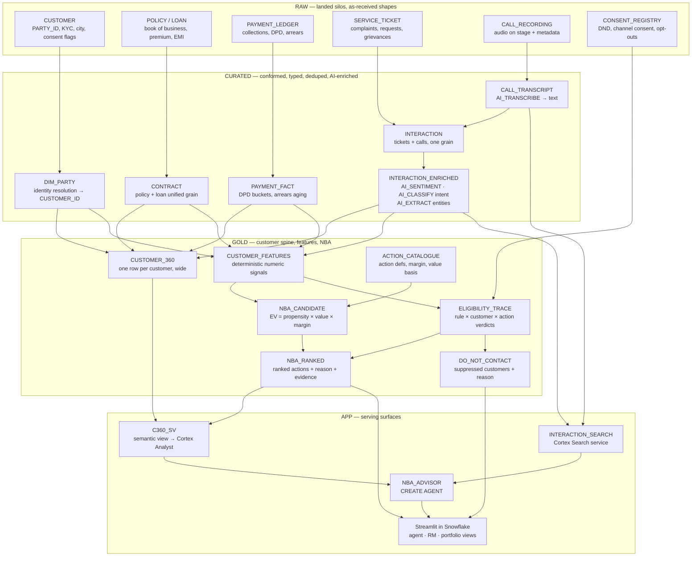

# C360-NBA — Customer 360 + Next Best Action Engine

**Snowflake CoCo CLI Hackathon (GCC edition) — problem statement: "AI-Native Data Application"**

A Customer 360 and Next Best Action engine for an Indian bank-and-insurer group.
One customer spine fuses structured book-of-business data with unstructured
interactions and emits a **ranked list of next best actions per customer** — each
carrying a reason, an expected value in INR, the evidence it was drawn from, and a
compliance trace showing why the customer was eligible to be contacted.

---

## 1. Users and pain

| User | Today | What this gives them |
|---|---|---|
| **Contact-centre agent** | Sees a wall of history mid-call. No recommendation, no reason. | Top 3 actions for the customer on screen, each with a one-line reason and the exact evidence behind it. |
| **Relationship manager** | Same wall, plus a book of customers and no prioritisation. | Their book ranked by expected value, with talking points per customer. |
| **Portfolio owner** | Cannot see which actions across the book are worth taking this week. | Book-level view of actions by expected value, and an explicit **do-not-contact** list with reasons. |
| **Compliance / risk** | Cannot reconstruct why a customer was targeted. | Per-recommendation compliance trace: every rule evaluated, its verdict, and the values it fired on. |

### The silo problem

Four sources, no join key in common use:

1. **Policy / loan systems of record** — the book of business.
2. **Payments and arrears** — premium and EMI collection, DPD buckets.
3. **Servicing tickets** — complaints, requests, grievances.
4. **Call recordings** — contact-centre audio, never mined.

Signals that matter live *across* these. A customer with a 45-day-overdue EMI, an
open grievance, and an angry call last week must not be cross-sold — but no single
system knows all three facts.

---

## 2. Product principles

These are non-negotiable and drive the architecture.

1. **Expected value is deterministic SQL, not an LLM guess.**
   `EV = propensity × value_at_stake × margin_rate`, every term computed in SQL from
   the book. An LLM that invents a rupee figure is not auditable and not defensible
   in a demo. The LLM writes the *narrative*, never the number.
2. **Compliance is deterministic rules with a stored trace.**
   Eligibility is never an LLM judgement. Each rule is a SQL predicate; each
   evaluation is persisted per customer per action so the verdict can be replayed.
3. **Suppression beats recommendation.**
   A do-not-contact verdict always wins over any expected value, however large.
4. **Every recommendation cites evidence.**
   Each action links to the specific interactions, tickets, transcripts and ledger
   rows that produced it. No evidence, no action.
5. **AI is applied where it is the only tool that works** — reading free text and
   audio, summarising, classifying intent — and nowhere else.

---

## 3. Hard constraints

- **One Snowflake account.** Database `C360_NBA`, role `COCO_BUILDER`, warehouse `COCO_WH`.
- **Schemas:** `RAW` → `CURATED` → `GOLD` → `APP`.
- **Snowflake-native only:** AI SQL functions, Cortex Search, semantic views +
  Cortex Analyst, `CREATE AGENT`, Streamlit in Snowflake. No external services,
  no external access integrations.
- **Every object is created by a numbered, idempotent script in `sql/`** that rebuilds
  the whole project from an empty database. `CREATE OR REPLACE` throughout.
  No manual Snowsight steps after bootstrap. One unavoidable exception, wrapped in
  `run.sh` — see decision D2.
- **Synthetic data only.** INR, Indian names and cities.

---

## 4. Target architecture



### Where AI is used, and where it deliberately is not

| Layer | AI function | Why AI is the right tool here |
|---|---|---|
| `CURATED.CALL_TRANSCRIPT` | `AI_TRANSCRIBE` | Audio → text. No SQL alternative. |
| `CURATED.INTERACTION_ENRICHED` | `AI_SENTIMENT` | Tone of a free-text note or transcript. |
| `CURATED.INTERACTION_ENRICHED` | `AI_CLASSIFY` | Intent taxonomy over unstructured text. |
| `CURATED.INTERACTION_ENRICHED` | `AI_EXTRACT` | Pull policy numbers, amounts, competitor mentions out of prose. |
| `GOLD.NBA_RANKED` | `AI_COMPLETE` (structured output) | Write the agent-facing *reason* and talking points, grounded in retrieved evidence. |
| `APP.INTERACTION_SEARCH` | Cortex Search | Retrieve the evidence passages an action cites. |
| `APP.NBA_ADVISOR` | `CREATE AGENT` + Cortex Analyst | Natural-language questions over the book. |
| **`GOLD.NBA_CANDIDATE` — expected value** | **none, by design** | Must be auditable arithmetic. |
| **`GOLD.ELIGIBILITY_TRACE` — compliance** | **none, by design** | Must be replayable rules, not judgement. |

---

## 5. The NBA contract

Each row of `GOLD.NBA_RANKED` answers five questions:

| Field group | Content |
|---|---|
| **What** | `ACTION_CODE`, `ACTION_NAME`, `CHANNEL`, `RANK` |
| **Why** | `REASON` (LLM, grounded), `DRIVER_FEATURES` (which signals fired) |
| **Worth** | `PROPENSITY`, `VALUE_AT_STAKE_INR`, `MARGIN_RATE`, `EXPECTED_VALUE_INR` |
| **Evidence** | `EVIDENCE_IDS` (interaction/ticket/transcript/ledger refs), `EVIDENCE_QUOTES` |
| **Allowed** | `ELIGIBLE`, `RULES_PASSED`, `RULES_FAILED`, `SUPPRESSION_REASON` |

Compliance rules in scope (deterministic, each with a trace row):

- Channel consent present and not withdrawn (`CONSENT_REGISTRY`).
- Not on DND for the proposed channel.
- No open grievance above a severity threshold.
- Cooling-off period since last outbound contact respected.
- Suitability: product not sold to a customer already holding it.
- Arrears gate: no cross-sell or upsell while in a DPD bucket beyond threshold.
- Vulnerability gate: flagged customers routed to service actions only.

---

## 6. Repository layout

```
sql/
  00_bootstrap.sql        role, warehouse, budget, database   (already applied)
  10_schemas.sql          RAW / CURATED / GOLD / APP + stages
  20_raw_*.sql            synthetic silo generation
  30_curated_*.sql        conform, dedupe, identity resolution
  35_curated_ai.sql       transcribe, sentiment, intent, extract
  40_gold_spine.sql       CUSTOMER_360, CUSTOMER_FEATURES
  50_gold_nba.sql         catalogue, eligibility trace, EV, ranking
  60_semantic_view.sql    APP.C360_SV
  65_search_service.sql   APP.INTERACTION_SEARCH
  70_agent.sql            APP.NBA_ADVISOR
  80_streamlit.sql        APP.C360_APP  (needs app files staged first)
  90_verify.sql           assertions across every layer
  99_teardown.sql         drop everything
app/                      Streamlit in Snowflake source
data/audio/               committed call-recording fixtures (.m4a)
evals/                    scored NBA + Analyst evaluation
docs/                     run order, cost notes, gotchas
run.sh                    full rebuild, including the one stage-copy step
```

Every SQL script is re-runnable against a database in any state. `run.sh` exists
because exactly one step in the rebuild is not SQL — see decision D2.

---

## 7. Verified environment

Confirmed by live query against this account before any SQL was written.

| Fact | Value |
|---|---|
| Account / org | `TX54963` / `HPQQELD` |
| Region | `AWS_AP_SOUTH_1` (AWS Mumbai) |
| Version | `10.30.102` |
| Role | `COCO_BUILDER` — `CORTEX_USER`, `CORTEX_AGENT_USER`, `CREATE SCHEMA` on `C360_NBA` |
| Warehouse | `COCO_WH` (XSMALL) with `COCO_BUDGET` resource monitor, 60 credits/month |
| Credits consumed to date | 0.301 |
| Cross-region inference | `CORTEX_ENABLED_CROSS_REGION = ANY_REGION` |
| Object types recognised | Cortex Search service, semantic view, agent, Streamlit — all present in this version |

**No text-generation model is hosted in-region in Mumbai.** Every `AI_COMPLETE` call
routes cross-region. Only embedding models (`snowflake-arctic-embed-*`,
`multilingual-e5-large`) run natively in `AWS_AP_SOUTH_1`. If
`CORTEX_ENABLED_CROSS_REGION` is ever reset to `DISABLED`, the entire AI layer stops.

AI functions smoke-tested successfully for `COCO_BUILDER` in this region:
`AI_COMPLETE` (`claude-opus-5`), `AI_CLASSIFY`, `AI_FILTER`, `AI_EXTRACT`,
`AI_AGG`, `AI_SUMMARIZE_AGG`, `AI_SENTIMENT`, `AI_TRANSLATE` (English → Hindi),
`AI_SIMILARITY`, `AI_EMBED`.

### Capability matrix for `AWS_AP_SOUTH_1`

| Capability | Verdict | How |
|---|---|---|
| Cortex Search | **Available natively in Mumbai** | `snowflake-arctic-embed-m-v1.5`, `-l-v2.0`, `-l-v2.0-8k` all in-region. `voyage-multilingual-2` is **not** available here. |
| Semantic views | **Available** | No region or edition gate. |
| Cortex Analyst | **Available via cross-region** | Not native in Mumbai; `ANY_REGION` covers it. |
| `CREATE AGENT` | **Available via cross-region** | Agent orchestration models are cross-region only by design. |
| Streamlit in Snowflake | **Available** | No region restriction. |
| `AI_COMPLETE`, `AI_CLASSIFY`, `AI_EXTRACT`, `AI_FILTER`, `AI_SENTIMENT`, `AI_SUMMARIZE_AGG`, `AI_TRANSLATE`, `AI_SIMILARITY`, `AI_REDACT` | **Available via cross-region** | Cross-Cloud (Any Region) column ticked. |
| `AI_AGG` | **Available — verified empirically** | Docs leave the Any-Region column blank, but a live call in this account succeeded. |
| `AI_TRANSCRIBE` | **Available via cross-region** | Native only in Oregon / N. Virginia / Frankfurt / Azure East US 2. Untested here — no audio fixture yet. |
| `AI_EMBED` | **Available**, embeddings in-region | Returns `VECTOR`. |

Embedding models for Cortex Search must be one of the three `snowflake-arctic-embed-*`
models, since those are the ones deployed in Mumbai.

---

## 8. Flagged risks — read before writing SQL

### R1. Cross-region inference is a single point of failure, and a narrative problem

No text-generation model is hosted in Mumbai. Every LLM call in this project leaves
the region. Two consequences:

- **Operational:** if `CORTEX_ENABLED_CROSS_REGION` is reset to `DISABLED`, the whole
  AI layer fails. Scripts must assert the parameter before the AI stages run.
- **Narrative:** a demo built for an Indian bank-and-insurer that ships prompts
  containing customer context out of India has an obvious data-residency question
  attached to it. This does not block the build, but it must be stated openly rather
  than discovered by a judge. The mitigations available in-region are: retrieval
  (Cortex Search) runs entirely in Mumbai on in-region embeddings, and `AI_REDACT`
  can strip PII before any prompt is sent cross-region. Both are worth doing on
  their own merits.

### R2. Budget is small relative to a naive AI design

60-credit monthly resource monitor with a hard suspend at 100%; 0.301 credits used.
Running a frontier model over every customer would be reckless. The design therefore
tiers models: a cheap model for bulk enrichment over all rows, a strong model only
for the narrow set of rows actually surfaced in the demo.

### R3. Cost telemetry lags, so token counting must be the gate

`SNOWFLAKE.ACCOUNT_USAGE.CORTEX_FUNCTIONS_USAGE_HISTORY` currently returns zero rows
despite AI calls having just run — this view has hours of latency. A
"run a sample, then check credits" gate does not work at demo tempo. Instead,
`AI_COUNT_TOKENS` is used to project cost before any batch run; it is instant and
available in every region. `COCO_BUILDER` also cannot read `ACCOUNT_USAGE` at all,
so after-the-fact verification needs the `coco_admin` (ACCOUNTADMIN) connection.

### R4. `sql/` alone cannot create the Streamlit object

`CREATE STREAMLIT` requires `streamlit_app.py` to already exist on a stage. A SQL
script cannot author a local file onto a stage; that needs a `PUT` or
`snow streamlit deploy` from the client. So the "everything is a numbered script in
`sql/`" rule has one unavoidable seam at the app layer. Resolution needed — see
open questions.

Note also that `ROOT_LOCATION` is now legacy; the current form is
`CREATE STREAMLIT … FROM '@stage/path' MAIN_FILE = 'streamlit_app.py'`, followed by
`ALTER STREAMLIT … ADD LIVE VERSION FROM LAST`.

### R5. Synthetic call audio cannot be produced Snowflake-natively

`AI_TRANSCRIBE` needs real audio on a stage. Nothing inside Snowflake generates
speech, and text-to-speech services are excluded by the no-external-services rule.
Either the audio path is demonstrated with locally generated fixture files committed
to the repo, or call recordings enter as already-transcribed text. Resolution needed
— see open questions.

### R6. Account edition unconfirmed

`SHOW ORGANIZATION ACCOUNTS` is blocked (no `MANAGE ORGANIZATION ACCOUNTS`) and
`ORGANIZATION_USAGE.USAGE_IN_CURRENCY_DAILY` is still empty. Edition is therefore
unverified. Low risk: nothing in this stack requires Enterprise — semantic views,
Cortex features and Streamlit have no edition gate, and no multi-cluster warehouse
or materialized view is used.

### R7. Bootstrap uses a deprecated function

`sql/00_bootstrap.sql` smoke-tests with `SNOWFLAKE.CORTEX.SENTIMENT`. That namespace
is deprecated; it should be `AI_SENTIMENT`. Cosmetic but worth fixing since the
bootstrap is the first thing a judge reads.

---

## 9. Decisions taken

These resolve the open questions raised by R2, R4 and R5, and fix the scope. They are
settled; the milestones below assume them.

### D1. Call recordings — hybrid, with a real audio path

The call silo carries ~25,000 rows of text notes for volume, plus **~12 genuine audio
files** committed under `data/audio/`, `PUT` to `RAW.AUDIO_STAGE` and transcribed for
real with `AI_TRANSCRIBE`. Fixtures are generated locally with the macOS `say`
command; that is a build-time fixture, not a runtime dependency, so the
no-external-services rule holds at runtime. This proves `AI_TRANSCRIBE` actually works
in `AWS_AP_SOUTH_1` — currently the only untested claim in the capability matrix — for
negligible cost.

`CURATED.CALL_TRANSCRIPT` is the union of the transcribed audio and the bulk text, so
everything downstream sees one grain and cannot tell which rows came from audio.

### D2. One documented non-SQL step in the rebuild

`sql/` remains authoritative for every database object. Exactly one step is not SQL:
copying `app/` to `APP.APP_STAGE` before `sql/80_streamlit.sql` runs. `run.sh` wraps
the whole sequence so the rebuild is one command and the seam is explicit rather than
hidden.

```
sql/00 … sql/70   →   snow stage copy app/ @APP.APP_STAGE   →   sql/80_streamlit.sql
```

### D3. Tiered models, token-gated

| Stage | Model | Volume |
|---|---|---|
| Bulk interaction enrichment — sentiment, intent, entity extraction | `claude-haiku-4-5` | ~25,000 interactions |
| Call transcription | `AI_TRANSCRIBE` default | ~12 files |
| NBA reason + talking points, demo slice | `claude-opus-5` | top 3 actions × ~200 customers |
| NBA reason, remainder of book | templated from deterministic drivers, no LLM | ~4,800 customers |

5,000 customers. `AI_COUNT_TOKENS` projects input tokens before every batch and the
projection is printed by the script; no batch runs blind. The templated fallback means
the book is fully populated even though only the demo slice gets frontier-model prose,
and `NBA_RANKED` carries a `REASON_SOURCE` column (`LLM` or `TEMPLATE`) so the
distinction is visible rather than concealed.

### D4. Scope — both lines of business

Insurance **and** banking, unified on one `CONTRACT` grain:

```
LINE_OF_BUSINESS ∈ { LIFE, HEALTH, MOTOR, HOME_LOAN, PERSONAL_LOAN, CARD }
```

This is what makes the silo pain real and lets actions cross the group — a home-loan
holder with no home cover is a `PROTECTION_CROSS_SELL`; a customer 45 days into a DPD
bucket on a personal loan is suppressed from every cross-sell regardless of how
attractive their insurance propensity looks.

---

## 10. Build milestones

Dependencies are strict: a milestone may not start until its predecessors are green.

| # | Milestone | Creates | Depends on |
|---|---|---|---|
| **M0** | Foundation | `sql/00_bootstrap.sql` (fix deprecated `SNOWFLAKE.CORTEX.SENTIMENT`), `sql/10_schemas.sql` → schemas `RAW`, `CURATED`, `GOLD`, `APP`; stages `RAW.AUDIO_STAGE`, `APP.APP_STAGE`; guard asserting `CORTEX_ENABLED_CROSS_REGION` is not `DISABLED` | — |
| **M1** | Synthetic silos | `sql/20_raw_book.sql` → `RAW.CUSTOMER`, `RAW.CONTRACT` (both LOBs), `RAW.CONSENT_REGISTRY`; `sql/21_raw_payments.sql` → `RAW.PAYMENT_LEDGER`; `sql/22_raw_service.sql` → `RAW.SERVICE_TICKET`; `sql/23_raw_calls.sql` → `RAW.CALL_RECORDING`. Each customer gets a hidden ground-truth segment that drives both their numbers and their note text, so evals are scoreable. | M0 |
| **M1a** | Audio fixtures | `data/audio/*.m4a` (~12, generated locally), staged to `RAW.AUDIO_STAGE` | M0 |
| **M2** | Conform | `sql/30_curated_party.sql` → `CURATED.DIM_PARTY`; `sql/31_curated_contract.sql` → `CURATED.CONTRACT`; `sql/32_curated_payment.sql` → `CURATED.PAYMENT_FACT` (DPD buckets); `sql/33_curated_interaction.sql` → `CURATED.INTERACTION` | M1 |
| **M3** | AI enrichment | `sql/35_curated_transcribe.sql` → `CURATED.CALL_TRANSCRIPT` (`AI_TRANSCRIBE` over staged audio, unioned with bulk text); `sql/36_curated_enrich.sql` → `CURATED.INTERACTION_ENRICHED` (`AI_SENTIMENT`, `AI_CLASSIFY` intent, `AI_EXTRACT` entities on `claude-haiku-4-5`). `AI_COUNT_TOKENS` gate first. | M2, M1a |
| **M4** | Customer spine | `sql/40_gold_spine.sql` → `GOLD.CUSTOMER_360`, `GOLD.CUSTOMER_FEATURES` | M3 |
| **M5** | Eligibility and EV | `sql/50_gold_actions.sql` → `GOLD.ACTION_CATALOGUE`; `sql/51_gold_eligibility.sql` → `GOLD.ELIGIBILITY_TRACE`, `GOLD.DO_NOT_CONTACT`; `sql/52_gold_ev.sql` → `GOLD.NBA_CANDIDATE`. **Deterministic SQL only, no AI.** | M4 |
| **M6** | Reasons and evidence | `sql/55_gold_nba_ranked.sql` → `GOLD.NBA_RANKED`. `claude-opus-5` structured output on the demo slice, template elsewhere, `REASON_SOURCE` recorded. Optional `AI_REDACT` on prompt inputs per R1. | M5, M7 |
| **M7** | Retrieval | `sql/65_search_service.sql` → `APP.INTERACTION_SEARCH` (Cortex Search over transcripts and notes, `snowflake-arctic-embed-l-v2.0`, in-region) | M3 |
| **M8** | Analytical layer | `sql/60_semantic_view.sql` → `APP.C360_SV` over spine, features, `NBA_RANKED`, `DO_NOT_CONTACT`; verified queries | M5, M6 |
| **M9** | Agent | `sql/70_agent.sql` → `APP.NBA_ADVISOR` with `cortex_analyst_text_to_sql` → `APP.C360_SV`, `cortex_search` → `APP.INTERACTION_SEARCH`, `data_to_chart`; `GRANT USAGE ON AGENT` to the demo user's default role | M7, M8 |
| **M10** | Application | `app/streamlit_app.py`, stage copy, `sql/80_streamlit.sql` → `APP.C360_APP` + `ALTER STREAMLIT … ADD LIVE VERSION FROM LAST`. Three views: agent desk, RM book, portfolio + do-not-contact. No external packages (no `CREATE INTEGRATION` available). | M9 |
| **M11** | Verification | `sql/90_verify.sql` — row counts, null rates, referential integrity, and a hard assertion that no suppressed customer appears as eligible. `evals/` — NBA scored against the hidden segment, Analyst questions with expected answers. | M10 |
| **M12** | Teardown and docs | `sql/99_teardown.sql`, `run.sh`, `docs/README.md` | M11 |

Critical path: **M0 → M1 → M2 → M3 → M4 → M5 → M6 → M8 → M9 → M10 → M11**.
M1a and M7 are off the critical path — audio fixtures can be produced any time before
M3, and Cortex Search can be built in parallel with M4–M5.
